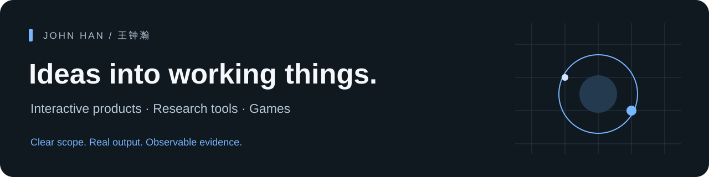

# 王钟瀚 · John Han

我做交互产品、研究工具、游戏原型和内容作品，关注如何把想法推进成可运行、可观看、可交付的结果。

I build interactive products, local research tools and playable systems. My work connects product direction, AI-assisted implementation, source discipline and observable acceptance.

**[作品总览 / Project atlas](https://github.com/Wangzhonghan311/han)** · **[视觉作品集 / Visual portfolio](https://john-han-portfolio.541117401.workers.dev/)** · **[工作方法与 Skills](https://github.com/Wangzhonghan311/agent-workbench)**

## Selected work

| Build | What it shows |
|---|---|
| **[研据 · ResearchDesk](https://github.com/Wangzhonghan311/researchdesk)** | Traceable source search, evidence cards, review and exports · Python/SQLite |
| **[ReportDesk](https://github.com/Wangzhonghan311/reportdesk)** | Real input validation, versioned approvals, stable snapshots and PDF delivery · Node/SQLite |
| **[百世登仙 · Baishi Dengxian](https://github.com/Wangzhonghan311/baishi-dengxian)** | A protected numerical core with a redesigned discovery/feedback layer · offline HTML |
| **[SVG Motion Studies](https://github.com/Wangzhonghan311/svg-motion-studies)** | Browser-native character animation in small, self-contained vector scenes |
| **[Agent Workbench](https://github.com/Wangzhonghan311/agent-workbench)** | Scoped reusable Skills, grounded in actual game, corpus, product and content cases |

## Work beyond the public source snapshots

[Physical ring toss](https://github.com/Wangzhonghan311/han/blob/master/cases/p03.md) · [Newspaper corpus engineering](https://github.com/Wangzhonghan311/han/blob/master/cases/p09.md) · [Xian long-term companion](https://github.com/Wangzhonghan311/han/blob/master/cases/p22.md) · [Android/MCP companion](https://github.com/Wangzhonghan311/han/blob/master/cases/p39.md) · [Card-strategy experiments](https://github.com/Wangzhonghan311/han/blob/master/cases/p38.md) · [Editable academic PPT](https://github.com/Wangzhonghan311/han/blob/master/cases/p42.md)

Public repositories use selected code and fictional samples. Private companion histories, personal databases, device pairing material and complete third-party corpora remain outside them. Local demonstrations, research results, delivered packages and production products have different completion boundaries.

## Working principles

- Define what is changing and what must remain true.
- Keep original sources, interpretation and human decisions distinct.
- Put repeated deterministic work into code; focus model effort on relevant judgment.
- Verify the actual workflow, visible action or time sequence that matters.
- Preserve failures and untested boundaries; keep delivery and user acceptance separate.

**Current publication:** a selected portfolio based on September 2026 work, published in October. The [project index](https://github.com/Wangzhonghan311/han/blob/master/catalog/README.md) explains the evidence and counting scope.

**直接体验 / Try online:** [百世登仙](https://wangzhonghan311.github.io/baishi-dengxian/) · [SVG 动画画廊](https://wangzhonghan311.github.io/svg-motion-studies/)
